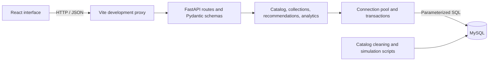

# SteamScope

**Find your next favorite game—and explore the numbers behind it.**

SteamScope is a database-driven game discovery, personal library, and analytics application built around a simple question: *“I loved this game. What should I play next?”*

It combines a real Steam catalog with simulated player profiles, a relational MySQL database, a FastAPI backend, and a React interface. It began as an academic database project and is being developed into a gaming-focused portfolio project.

| Project snapshot | Current implementation |
| --- | --- |
| Catalog | 141,899 imported Steam catalog entries |
| User layer | 3,000 seeded demo profiles with simulated collections and activity |
| Database | 24 relational tables with primary keys, foreign keys, and junction tables |
| Backend | FastAPI, parameterized SQL, connection pooling, transactions, response validation |
| Frontend | React + Vite dashboard connected to the local API |
| Recommendations | Explainable, rule-based attribute matching implemented in SQL |
| Status | Working local MVP; design refinement and production deployment remain ahead |

## Features

### Discover games

- Browse and search the catalog with pagination.
- Filter by genre and platform in the UI; the API also supports tags, categories, developers, publishers, languages, and price ranges.
- Sort by popularity, name, release date, or price.
- Open game details with descriptions, screenshots, platforms, and genre information.
- Explore similar games based on shared tags, genres, and developers.

### Build a personal collection

- Select a demo profile using the searchable profile picker.
- Add or remove games from a library and wishlist.
- Favorite owned games to influence recommendations.
- Search and sort the library, wishlist, and favorites.
- See collection counts and membership indicators across screens.

Changes persist in MySQL. Adding a game to the library removes it from the wishlist in the same transaction. Favorites are a subset of owned games. Removing ownership preserves historical purchases, achievements, and activity. Collection actions do not create purchases or play sessions.

### Find something that fits

The **For you** screen recommends games the selected profile does not own. Each match includes evidence such as a shared tag and the library game that contributed it. Profiles without usable preference signals receive a clearly labeled popularity fallback.

### Explore rankings and analytics

- **Steam popularity:** recorded peak concurrent players, positive review counts, and recommendation counts from the catalog.
- **Demo community:** ownership counts, distinct active profiles, and recorded play minutes from simulated data.
- **Analytics:** genre distribution, platform support, and releases by year.
- Activity ranking endpoints support date windows; the initial UI shows all recorded activity.

Steam metrics are stored snapshots, not live measurements. Community activity is simulated. The UI and API keep these sources distinct.

## Tech stack

| Layer | Technology | Role in SteamScope |
| --- | --- | --- |
| Interface | React 19, JavaScript, JSX | Reusable game cards, profile selection, collections, dialogs, and dashboard screens |
| Styling | CSS, inline SVG icons | Responsive ink-purple layout, lime/lavender accents, loading states, and interactive feedback |
| Frontend tooling | Vite 6, Node.js, npm | Development server, local API proxy, dependency management, and production bundle |
| Backend language | Python | API implementation, data processing, and test code |
| API framework | FastAPI | HTTP routes, input validation, and generated interactive API documentation |
| Response contracts | Pydantic | Defines and validates the JSON shapes consumed by the frontend |
| Application server | Uvicorn | Runs the FastAPI application |
| Database | MySQL with InnoDB | Relational storage, referential integrity, joins, aggregation, and transactions |
| Database access | MySQL Connector/Python | Executes parameterized SQL through a shared connection pool |
| Data preparation | Python, pandas, standard-library JSON/CSV tools | Source profiling, cleaning, transformation, and relationship extraction |
| Testing | Python `unittest`, FastAPI TestClient, HTTPX | Live API/database integration checks |
| Database inspection | MySQL Workbench / MySQL CLI | Schema inspection, queries, and migration application |
| Version control | Git | Tracks code and documentation changes |

The application uses **raw SQL, not an ORM**. Joins, aggregates, common table expressions, primary/foreign keys, and explicit transaction boundaries are visible in the implementation for course review. Recommendations use deterministic rules; there is no trained ML model.

The current development environment was checked with **Python 3.13.5**, **Node.js 22.19.0**, **React 19.3.0**, **Vite 6.4.3**, **FastAPI 0.135.2**, and **Pydantic 2.12.5**. The schema was designed for MySQL 8 features. Frontend dependencies are recorded in [package-lock.json](frontend/package-lock.json); backend dependency ranges are in [requirements.txt](backend/requirements.txt).

## Architecture



During local development, the frontend runs on port **5173** and forwards `/api` requests to FastAPI on port **8000**. The browser never connects directly to MySQL. Production hosting needs a separate proxy configuration; Vite's development proxy is not included in its output bundle.

API responses share a common game-card model. Attributes and membership flags are fetched in batches for each page, avoiding one request per game. A bounded wait for database connections accommodates simultaneous dashboard requests. Writes commit together or roll back on failure.

## Data and relational design

### Source quality and provenance

The original games CSV contained serious structural corruption and shifted field mappings. The catalog was recovered from the clean JSON source, transformed into game records and normalized relationships, and imported into MySQL. Existing profiling and cleaning notes preserve the investigation behind that decision.

| Data | Origin / interpretation |
| --- | --- |
| Game metadata, attributes, images, review counts, popularity fields | Real imported Steam catalog data |
| Demo identities, libraries, wishlists, purchases, achievements, play activity | Synthetic data generated for the project |
| Favorites and later collection changes | Stored actions performed on the selected demo profile |
| Real review author identifiers | External Steam identifiers; not the simulated profile IDs |

The imported catalog can include software and other Steam application types as well as games. Recorded prices, scores, and dates may be missing or stale. A zero recorded price is not a guarantee that an application is currently free on Steam. Source download attribution and a reproducible database bootstrap still need to be packaged for a fresh-clone handoff.

### Table groups

| Group | Tables |
| --- | --- |
| Catalog | `game` |
| Reference attributes | `developer`, `publisher`, `genre`, `tag`, `category`, `platform`, `language` |
| Many-to-many relationships | `game_developer`, `game_publisher`, `game_genre`, `game_tag`, `game_category`, `game_platform`, `game_language` |
| Media and reviews | `game_screenshot`, `review` |
| Profiles and collections | `user`, `library`, `wishlist` |
| Simulated history and progression | `purchase`, `achievement`, `user_achievement`, `user_activity` |

Reference tables prevent repeated attribute strings across game records. Junction tables resolve many-to-many relationships, and composite keys prevent duplicate memberships. Foreign keys enforce valid references. The completed data cleanup reported zero orphaned rows; that is a result for the imported dataset, not an ongoing audit performed by this README.

Favorites are stored as `library.is_favorite`; its migration is in [database/migrations](database/migrations). The early [relational schema document](docs/Relational_Schema/SteamScope_Relational_Schema.md) is design history and contains differences from the implemented schema. Inspect the current database for exact column definitions.

## How recommendations work

For each candidate game, the engine counts shared attributes with each library game:

| Signal | Weight |
| --- | ---: |
| Shared tag | 3 |
| Shared genre | 1 |
| Shared developer | 2 |
| Favorite source game | Multiplies that source game's contribution by 3 |

```text
candidate score = sum over library games:
    source weight × (3 × shared tags + shared genres + 2 × shared developers)
```

Candidates are ordered by match score, positive review count, then app ID. Popularity breaks ties rather than overriding relevance. Each relationship type is aggregated independently to avoid inflated scores from multiplying joined rows.

Owned games are excluded from personal suggestions; the source game is excluded from its own similar-game results. Similarity from one game uses the same rules with a single source. This first version uses ownership and favorites as preferences, not inferred taste from playtime.

## Run locally

### 1. Prepare the database

You need a running MySQL server with the existing `steamscope` schema and data. **A fresh clone does not yet create or populate this database automatically.** Large datasets are excluded from Git, and some JSON recovery / initial-schema artifacts still live outside this repository in the original working folder. The scripts directory includes earlier experiments and loaders; it is not yet a single ordered bootstrap pipeline.

For an existing database without `library.is_favorite`, select `steamscope` in Workbench and run `database/migrations/001_library_favorites.sql` once. This migration has already been applied to the current development database.

### 2. Start the backend

From the repository root:

```sh
cd backend
python3 -m venv .venv
source .venv/bin/activate
python3 -m pip install -r requirements.txt
cp .env.example .env
```

Edit `.env` for your MySQL connection, then start the API:

```sh
python3 -m uvicorn app.main:app --env-file .env --reload --host 127.0.0.1 --port 8000
```

| Setting | Purpose | Local default |
| --- | --- | --- |
| `DB_HOST` / `DB_PORT` | MySQL server address | `127.0.0.1` / `3306` |
| `DB_USER` / `DB_PASSWORD` | Database credentials | `root` / empty password |
| `DB_NAME` | Database name | `steamscope` |
| `DB_SOCKET` | Optional Unix socket override | Unset |
| `FRONTEND_ORIGINS` | Allowed browser origins | Localhost and 127.0.0.1 on port 5173 |

These defaults reflect the local development setup. Configure your credentials in `.env`; that file is excluded from Git.

### 3. Start the frontend

In a second terminal, from the repository root:

```sh
cd frontend
npm ci
npm run dev
```

| Interface | Address |
| --- | --- |
| SteamScope application | http://127.0.0.1:5173 |
| Interactive API documentation | http://127.0.0.1:8000/docs |
| Database readiness check | http://127.0.0.1:8000/health/ready |

Keep MySQL and both development servers running. Detailed instructions are in the [backend README](backend/README.md) and [frontend README](frontend/README.md).

## Suggested project-review walkthrough

1. Select a demo profile and browse the real catalog.
2. Search for a game and open its details and similar-game suggestions.
3. Add an unowned game to the wishlist, then add it to the library. Show that the wishlist entry disappears and the library count increases.
4. Favorite the game and open **For you**. Explain the shared-attribute evidence and why favorites receive extra weight.
5. Switch profiles to demonstrate that collections and membership flags change.
6. Compare **Steam popularity** and **Demo community** rankings, explaining snapshot metrics versus simulated activity.
7. Open analytics, then `/docs` to connect a visible screen to its API endpoint.

For a technical review, useful examples include the atomic library/wishlist transition, shared response schemas, recommendation CTEs, and distinct-player aggregation. The project demonstrates data cleaning, relational modeling, SQL queries, transaction handling, and frontend/backend integration in one application.

## API overview

| Area | Representative endpoints |
| --- | --- |
| Catalog | `GET /games`, `GET /games/{app_id}`, `GET /filters/{kind}` |
| Profiles | `GET /users`, `GET /users/{user_id}`, `GET /users/{user_id}/summary` |
| Collections | `GET /users/{user_id}/library`, `/wishlist`, `/favorites` |
| Collection edits | `PUT` / `DELETE /users/{user_id}/library/{app_id}` and `/wishlist/{app_id}` |
| Favorites | `PATCH /users/{user_id}/library/{app_id}/favorite` |
| Discovery | `GET /games/{app_id}/similar`, `GET /users/{user_id}/recommendations` |
| Rankings | `GET /analytics/rankings?source=steam&metric=peak_ccu` (also supports community metrics) |
| Analytics | `GET /analytics/genre-stats`, `/platform-stats`, `/yearly-releases`, `/top-games` |
| Profile history | `GET /users/{user_id}/activity`, `/achievements` |
| Health | `GET /health`, `GET /health/ready` |

Paginated lists return `total`, `limit`, `offset`, and `results`. Pass `user_id` to catalog/discovery requests to include `is_owned`, `is_wishlisted`, and `is_favorite`; these flags are null without a selected profile. PUT/DELETE collection actions return 204 with no JSON body. Favorite updates use an explicit boolean so retrying a request cannot accidentally toggle it twice.

## Verification

Run backend tests from `backend/`, with database settings exported in the shell (the test command does not load `.env` automatically):

```sh
python3 -m unittest discover -s tests -v
```

**Seven live MySQL tests passed** during the current implementation. They cover:

- Collection persistence, repeated requests, and transaction rollback.
- Membership flags, profile switching, counts, search, sorting, and pagination.
- Response contracts and missing-resource behavior.
- Recommendation scores checked against attribute intersections and favorite weights.
- Inclusive activity date boundaries and distinct-player counts.
- Concurrent reads waiting for available pooled connections.

Tests create and clean up isolated profiles/activity where needed; auto-increment IDs may advance. Use a development database.

The frontend production build passed:

```sh
cd frontend
npm run build
```

Browser checks verified catalog rendering, game details, the recommendations entry point, and analytics against the live API. The refreshed design was inspected at desktop (1440px) and phone (390px) widths. Automated browser coverage and a full responsive/accessibility audit are still pending; a successful bundle build alone does not verify every UI flow.

## Repository map

```text
SteamScope-main/
├── backend/
│   ├── app/
│   │   ├── main.py                 # API setup, lifecycle, health checks
│   │   ├── db.py                   # Pooling and transaction boundaries
│   │   ├── schemas.py              # Shared response contracts
│   │   ├── cards.py                # Batched card and membership data
│   │   ├── collection_queries.py   # Collection search, sorting, pagination
│   │   └── routers/                # Catalog, profiles, edits, discovery, analytics
│   ├── tests/                     # Live integration tests
│   ├── .env.example
│   └── requirements.txt
├── frontend/
│   ├── src/main.jsx                # Screens, components, API interactions
│   ├── src/styles.css              # Responsive visual design
│   ├── src/identity.css            # Editorial theme and responsive refinements
│   ├── vite.config.js              # Local frontend/API proxy
│   └── package-lock.json
├── database/migrations/            # Incremental schema changes
├── scripts/                        # Profiling, cleaning, loading, simulation
├── data/                           # Local datasets; large raw/cleaned files ignored
└── docs/                           # Design history, data notes, backend plan
```

## Current boundaries and next steps

- **Demo identity:** profile selection is not authentication or authorization. The current application is intended for local demonstrations, not public access.
- **Historical data:** no live Steam API synchronization, live player counts, checkout, or Steam account linking is implemented.
- **Recommendation quality:** scoring is an explainable baseline; relevance, diversity, and broader performance testing can be improved.
- **Frontend:** the first functional design is implemented; further interaction, mobile, and accessibility refinement remains.
- **Analytics:** the current charts are a baseline; deeper analysis questions are still being selected.
- **Reproducibility:** package the final base schema, JSON recovery pipeline, source attribution, and database setup before distributing a fresh-clone demo.
- **Deployment:** production credentials, authentication, hosting, monitoring, and automated browser tests are future work.

SteamScope is an independent academic/portfolio project and is not affiliated with Valve or Steam. Game artwork and source metadata remain associated with their respective owners.
